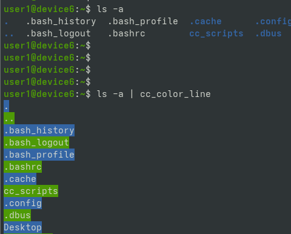

# ABOUT THIS REPOSITORY

## ABOUT PROJECT

Multi-purpose shell functions.

All these functions are wrapper functions (they only call other commands like grep, cat, curl, ipconfig which available on your local machine). Some example functions can be seen below.

## EXAMPLE FUNCTIONS

## DOCUMENTATION

All documentations are inside [documentation](./documentation) directory.
